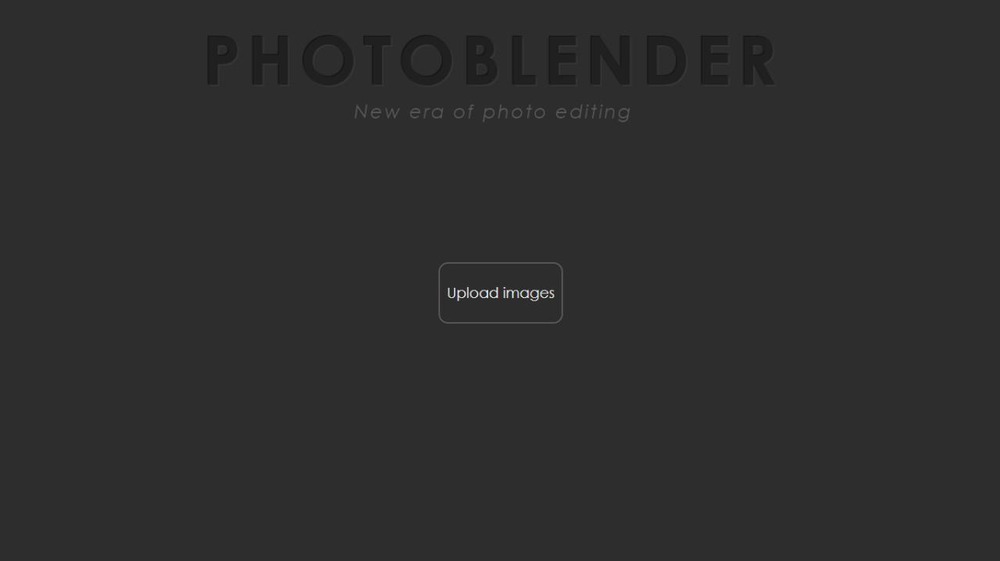
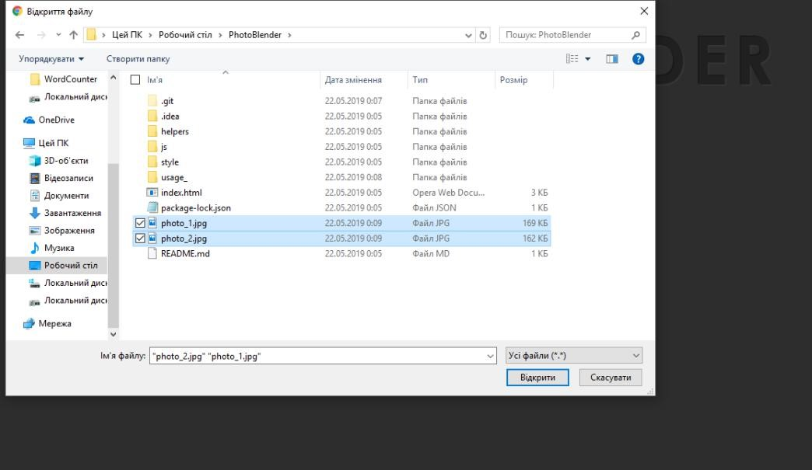
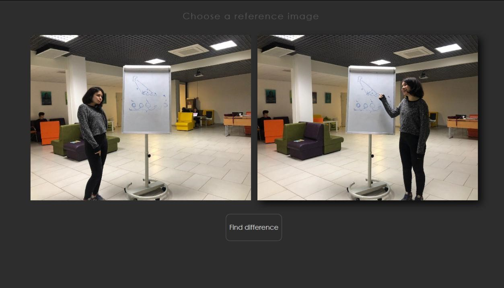
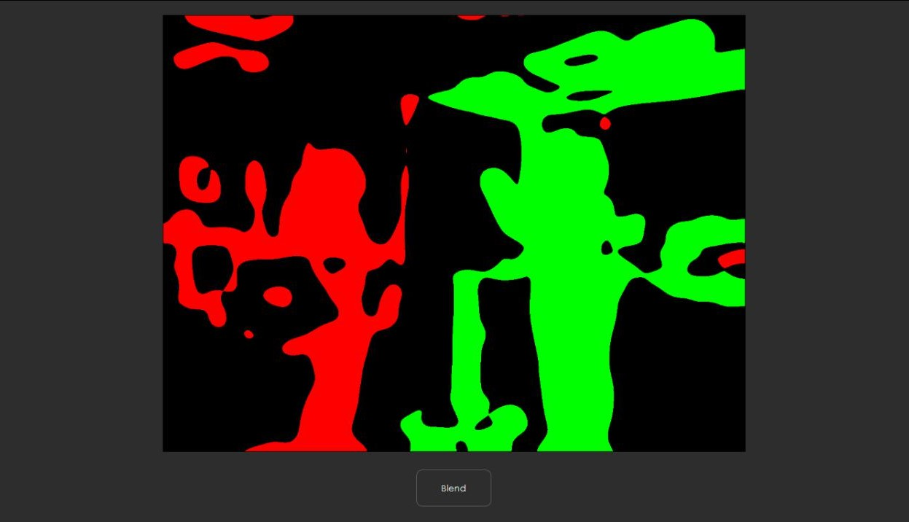

# :camera: PhotoBlender

> Create one best photo from multiple...




## Table of contents
 - [Getting started](#getting-started)
   - [Installing](#installing)
   - [Usage](#usage)
 - [Team](#team)


## Getting started

### Prerequisites
| **Component**                 |
|------------------------------	|
| Browser  	|     :blush:  	|

  
### Installing
  1. Clone project.
  ```bash
  $ git clone https://github.com/SophiaZhyrovetska/PhotoBlender
  ```
  2. Open `index.html` in your browser.

### Usage 
 1. Click the "Upload photos" button
 2.Select 2 photos   
 3. Choose reference image   
 4. Click the "Find difference" button  
 5. Choose the part you want to add
   
 6. Click the "Blend" button  
 7. Enjoy the result :heart:  


## Team
| **Prots Olha** | **Tymchenko Yulianna** | **Zhyrovetska Sophia** |
| :---: |:---:| :---:|
| [hungrynagini](https://github.com/hungrynagini) | [neverlandjt](https://github.com/neverlandjt) | [SophiaZhyrovetska](https://github.com/SophiaZhyrovetska) |


© 2019 Prots Olha, Tymchenko Yulianna, Zhyrovetska Sophia
